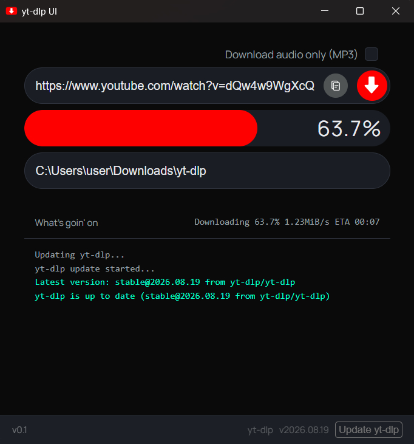

# yt-dlp UI

Vibe coded, lightweight, native-feeling desktop GUI for [yt-dlp](https://github.com/yt-dlp/yt-dlp) on Windows — paste a URL, pick a folder, download. No terminal required.


## Features

- Paste & download — clipboard paste button, Enter-to-start
- Video (MP4) or audio-only (MP3) downloads
- Live progress bar and status while downloading
- Custom save folder, defaults to `Downloads/yt-dlp`
- Auto-downloads `yt-dlp.exe` on first run, one-click update afterwards
- Packaged as a single portable `.exe` — no Python install needed for end users

## Download

Grab the latest build from the [Releases](../../releases) page and run `yt-dlp-ui.exe`. No installer, no admin rights required.

## Screenshots



## Running from source

Requires Python 3.10+ on Windows.

```bat
git clone https://github.com/cemersozlu/yt-dlp_UI.git
cd yt-dlp_UI
pip install -r requirements.txt
start.bat
```

## Building the executable

```bat
cd packaging
build.bat
```

The output binary is written to `dist\yt-dlp-ui.exe`.

## Project structure

```
yt-dlp_UI/
├── app/                # Python backend (Flask + pywebview)
│   ├── main.py
│   └── server.py
├── web/                # Frontend (served by Flask, rendered in a webview)
│   ├── index.html
│   ├── style.css
│   ├── app.js
│   └── assets/
├── packaging/           # PyInstaller build config
│   ├── build.bat
│   └── yt-dlp-ui.spec
├── start.bat
└── requirements.txt
```

## How it works

The app starts a local Flask server (`127.0.0.1:5050`) and opens it in a native window via [pywebview](https://pywebview.flowrl.com/). Downloads are handled by invoking the standalone `yt-dlp.exe` binary as a subprocess and streaming its progress back to the UI — yt-dlp itself is not bundled as a Python dependency, so updating it doesn't require rebuilding the app.

## Contributing

Issues and pull requests are welcome.

## License

[GPL-3.0](LICENSE) — see the LICENSE file for details. Forks and derivatives must remain open source under the same license.
